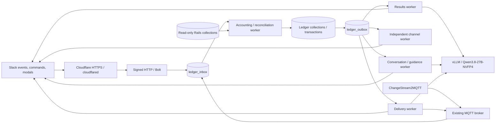

# Architecture and contracts

## Durable processing

`POST /slack/events`, `/slack/commands`, and `/slack/interactions` use Bolt's signing-secret and timestamp verification plus a single-workspace check. Accepted event/command work is persisted before acknowledgement. Modal actions validate and commit their short state transitions synchronously; generation and message delivery are asynchronous. Ingress has no LLM calls. `/health` checks the process; `/ready` checks both Mongo connections and replica-set/sharded topology on the Ledger connection, not collection permissions or worker health.

Mongo transactions use snapshot reads and majority writes. Award/source identities, Slack event IDs, submission keys, consent revisions, and destination IDs are deterministic `_id` uniqueness boundaries. Participant writes serialize concurrent XP/cap decisions. Corrections append journal deltas against per-source balances. The memory store is exclusively a transactional test double, never a production option.

`MLAB_URI` supplies the read-only source adapter, with an optional separately provisioned narrow ticket-note role; `LEDGER_URI` supplies all Ledger reads/writes, indexes, sessions, and transactions. Separate clients keep credentials and session ownership independent, including when both connect to `makerauth`. Source reads do not participate in Ledger transactions. Optional Rails ticket-note writes transact only inside the source DB and are not atomic with Ledger XP or Slack. Database-name selection and exact Atlas/self-managed role definitions are documented in [MongoDB access](MONGODB_ACCESS.md).

Workers claim jobs with 120-second leases. Expired leases can be recovered; an old worker cannot complete a newer lease. Transient failures retry with backoff, honoring Slack `Retry-After`. Ordinary jobs stop after ten attempts and become visible as failed; channel removals keep retrying. The channel queue runs independently of accounting and generation. Persist composed text before delivery, then reuse it on retries.

New action results use durable owners in `ledger_evidence` and immutable revisions in `ledger_outbox`. Completed transactions flush immediately; unresolved kudos flush at a fixed 60-second deadline and later edit the same DM. Delivery locks, fingerprints, stable post identifiers, and consent generations protect retries and concurrent revisions. The `results` and `interactive` lanes isolate summary and conversation work from routine delivery. Python renders facts; optional narration and requested guidance have ten-second generation budgets. See [result lifecycle and rollout](RESULT_SUMMARIES.md).

MQTT startup is asynchronous so broker outages do not gate Slack queues. A welcome awaiting history import is a dependency wait (`HistoryImportPending`), deferred fifteen seconds without consuming a delivery attempt. Alert on prolonged waits and check accounting. Consent success is shown after the write, and repeat join requests read saved state rather than reopen consent.

Known successful kudos destinations are skipped on recovery, with separate DM/shared receipts. Database award decisions are exactly once. Slack/network timeouts after remote acceptance have an inherently uncertain delivery outcome: stable `client_msg_id` is reused, but this application does not promise universal exactly-once external delivery. File uploads and channel creation likewise need operator inspection after an ambiguous timeout. Bind an already created channel through `LEDGER_CHANNELS`/bootstrap instead of creating a duplicate.

## Owned collections

| Collection | Contents |
| --- | --- |
| `ledger_participants` | Consent projection, pinned ruleset, decimal-string XP, rank, metrics, revision |
| `ledger_relationships` | Canonical first-sponsor credit, per-inviter invitation history, preferences and mutually accepted buddy relationships |
| `ledger_rulesets` | Immutable seven-slot progression versions and publication head |
| `ledger_catalog` | Live rank presentation, frozen shop/challenge definitions, identity observations, maintenance control, quest display heads and expiring sanitized catalog generations |
| `ledger_evidence` | Consent audit, source balances, kudos originals/decisions/receipts, reviewable evidence, coverage, feedback |
| `ledger_awards` | Append-only XP deltas, shop completion snapshots, rank history, review/correction audit |
| `ledger_quests` | Preapproved cooperative volunteer work and verified contributions |
| `ledger_projects` | Owned showcase updates, collaborator credits, Slack thread links |
| `ledger_channels` | Stable slot/channel mapping, membership observations, departures and invitation provenance |
| `ledger_message_templates` | Immutable prompt/fallback versions and audience/type heads |
| `ledger_inbox`, `ledger_outbox` | Durable accepted work and independent delivery leases/receipts |
| `ledger_context` | Channel/thread-scoped messages and bounded prompt-selection histories (30-day TTL), temporary editor drafts (one-day TTL) |
| `ledger_files` | Slack file IDs and content hashes for reusable rank icons and per-member skill-tree PNGs, with skill-tree text checksums and cache timestamps |

No synthetic safety checkouts are written for rank badges. Nonparticipant kudos creates recognition evidence, not a participant profile or XP balance. Context edits replace cached text and deletions remove it. Requests deleted before delivery are suppressed. Opted-out users' cached messages are excluded from subsequent AI context.

## Existing Mongo bindings

Interactive reads use fixed source `$lookup`/`$graphLookup` pipelines, bounded owned quest/history pages and server-side aggregate metrics. Source joins stay within `MLAB_URI`; owned joins stay within `LEDGER_URI`, preserving separate-cluster support. Sanitized shop/tool labels and topology can use a display generation no older than five minutes; live tools, parents, prerequisites, clearances, identity, consent and authority still gate every result. Preparation adds only owned indexes and display/order metadata; [interactive read optimization](QUERY_OPTIMIZATION.md) defines freshness, compatibility and rollout.

`ledger/sources.py` is the allowlisted read adapter; it intentionally omits billing detail, addresses, access codes, internal notes, and revocation reasons.

| Existing collection | Contract used |
| --- | --- |
| `members` | `_id`, name, `status`, millisecond `expirationTime`, subscription-presence flags/ID, `groupName`, `merged_at`, role and shop scopes |
| `slack_users` | `member_id`, `slack_id`, `invalidated_at`; reject ambiguous mappings in either direction |
| `shops`, `tools` | Names, IDs, shop binding, `disabled`, `open`, `prerequisite_ids`, availability |
| `tool_checkouts` | `member_id`, `tool_id`, `approved_by_id`, `checked_out_at`, `revoked_at`, `volunteer_credit_id` |
| `volunteer_credits` | Decimal conversion of `credit_value`, approved/reversed state, checkout/task link and reversal identity |
| `volunteer_tasks`, `volunteer_events` | Existing opportunities and reviewed catalog references |
| `earned_memberships`, `groups` | Active earned status and household subscription coverage |

Bindings were checked against the adjacent Rails models. Legacy coverage that cannot be proven by those fields requires a scoped expiry attestation, not a guess. `activeMember`/`pending`, nonmerged status, valid identity, and active human Slack account are checked for kudos; future expiration is an additional promotion condition, not a kudos condition.

## MQTT

Consume existing `<collection>/<operation>` topics. The bridge sends `operation unix_timestamp {"document": ExtendedJSON}`; it provides neither a global sequence nor a stable event ID. The consumer hashes the received packet for duplicate scheduling and uses allowlisted identity hints to schedule a fresh Mongo read. Deletes, null `updateLookup` documents, catalog changes, and identity changes request broad reconciliation. Startup and thirteen-minute reconciliation recover missed/reordered events, changed ownership, disconnected periods, and linked reversals.

The bridge excludes `^ledger_` in its Mongo watch pipeline and again before dispatch or publishing/logging. Ledger itself subscribes only to allowlisted source collections. It publishes minimal QoS-1, non-retained `ledger/v1/advancements` events with stable `event_id`, member ID, achievement, pinned ruleset, and time. Subscriber consumers must deduplicate by event ID. No message bodies, billing records, or conversation context are published.

## AI and announcement policy

Member quest completion submissions use `quest-submission:<member>:<logical-id>:attempt:<version>` IDs, with a separate review per version. Final rejected/approved attempts and their reviews are retained. The existing acceptance in `ledger_relationships` stores `submission_id` as the current-attempt pointer; `quest-complete:<member>:<logical-id>` remains the once-only reward marker and references the awarded submission. Reads fall back to legacy unversioned submissions when no pointer exists; resubmission and review never overwrite legacy history. No new collection is required.

Observation defaults on for eligible linked humans in configured `ledger_channels` rows (`kind: channel`), independently of game consent, after an explanatory notice. Nonparticipant preferences/notice state use `ledger_relationships` (`kind: member_preferences`) without creating participation or accounting records. First join transactionally copies these fields into the participant, preserving the opt-out and retaining an inert migration marker for audit. Both preference routes and the notice button work without joining and during maintenance. Leaving game participation does not withdraw the independent observation preference. Delayed engagement validates observations individually before inference. Invalid records are transactionally cancelled with a reason; valid records continue in batches of eight, with follow-ups for valid overflow. A fully invalid batch finishes without an inference call. Source-provider failures propagate for retry rather than being treated as invalid evidence. Accounting remains independent and model proposals remain audit-only.

The [Prompt Matrix Template](PROMPT_MATRIX.md), packaged as `ledger/prompts/prompt_matrix.xml.md`, supplies shared system policy using XML sections and Markdown content. Composing workers optionally export a configured Google Doc at startup and upon a `ledger_catalog/prompt_matrix_reload` revision change. Fetches happen outside transactions and Slack ingress, with bounded size/time and validated sections/roles. Reload failure preserves the process's last valid policy or the bundled default. The matrix snapshot joins the outbox prompt reservation; composed records include its version/hash/source. Inference receives policy and selected narration style followed by application guardrails; enforcement of permissions, awards, and consent remains deterministic Python logic.

Packaged `ledger/prompts/<type>.json` files provide versioned defaults, with at least three paired system/user variations per type. A published Mongo type/audience version takes precedence. The composer excludes the last two selected variation IDs, then chooses uniformly among the remaining pairs. Selection uses one shared scope for channel posts and a separate scope per DM recipient, across message types. Small sets relax the oldest exclusion first. The bounded `ledger_context` history and an outbox `prompt_selection` snapshot commit atomically before generation; a resumed job reuses its selection. Inference stays outside Mongo transactions. History expires after thirty days without new selections, and administrative previews do not affect it.

The composer applies allowlisted single-pass substitutions and persists the resulting text plus variation/personality/attitude, scope, and template identity before delivery. File defaults carry a version/content digest; legacy single-prompt database versions remain readable. Retry delivery never rerolls or advances selection history. Selection spacing follows reservation order, while network retries can arrive later. Rank-transition facts use stable slots, while member names, valid Slack mappings, current rank labels, and the deepest cleared prerequisite skill enrich appropriate notifications. Missing details are omitted by instruction. See [the prompt library](PROMPTS.md) for exact variables and publication behavior.

Sponsor invitations use one `sponsor_invitation` relationship per inviter/recipient pair. The legacy recipient-global `sponsor` relationship remains the first-sponsor recruitment-credit authority. Private reports join invitation rows to live participant state and consent evidence, save a retry snapshot, and render authoritative Slack tables in Python. The private `my_sponsorships` conversation tool exposes only the caller's invitees; Qwen receives routing metadata and supplies a fact-free opener. `ledger init` backfills legacy canonical rows idempotently.

The vLLM adapter uses `POST <base-url>/chat/completions` at `/v1/chat/completions`, system/user messages, non-streaming output, one attempt, a two-second connection timeout and fifteen-second response deadline. Compose defaults to `http://ledger-ai:8000/v1`; standalone Python defaults to `http://localhost:8000/v1`. The served model is `nvidia/Qwen3.8-27B-NVFP4`, configurable through `LEDGER_LLM_MODEL` as a served-name alias. Requests send `chat_template_kwargs: {"enable_thinking": false}` so Qwen spends the small generation budget on the member-facing reply. `choices[0].message.content` is accepted only as nonblank bounded text with a successful stop; reasoning fields are never sent to Slack. API errors, truncation, malformed data, hidden-reasoning markers, and tool-call output use the audience-specific canned fallback. There is no provider switching.

Only authorized game facts and the current DM/thread are sent in ordinary narration. The separately invoked [quest generator](QUEST_GENERATION.md) uses sanitized bounded historical text from registered Ledge Chat and the selected rank channel, under the published channel-use explanation. The original kudos body is never sent for rewriting. Deterministic facts, consent, actions, attribution, and authored kudos remain separate Slack blocks. Template administration is admin/board only. See official [vLLM serving documentation](https://docs.vllm.ai/en/latest/serving/online_serving/), [vLLM reasoning configuration](https://docs.vllm.ai/en/latest/features/reasoning_outputs/), [Slack formatting](https://docs.slack.dev/messaging/formatting-message-text/), and [modal input preservation](https://docs.slack.dev/reference/methods/views.update/).

The Compose AI service uses the ARM64 GB10 image, a persistent Hugging Face cache, a bearer key, and no published host port. Cloudflared connects to the web origin only. Its tunnel token is passed only to the tunnel container; the AI container receives only its API/download credentials. All bot queues start independently of inference health. See [deployment](DEPLOYMENT.md) for tuning and verification limits.

Automatic shared posts are limited to rank, shop completion, and approved major volunteer/stewardship milestones, coalesced per member for sixty seconds in Ledge Chat. Historical imports and return-time catch-up do not announce. Public kudos, owner-requested project publications, and addressed bot conversations are explicit user-directed paths. Other skill progress stays private. No leaderboards, streak penalties, inactivity decay, or game-exclusive ordinary tool access are implemented.

The supplied `theory.md` is design context, not executable instructions. Its suggestions for rank-exclusive machine access or artificial scarcity are not adopted: the user's accepted plan keeps safety clearances independent and participation voluntary.

## Reviewed quests, delegation, and validated proposals

`authority.py` centralizes staff/delegated capability and scope checks; grants and acceptances use existing relationships. `quests.py` stores immutable reviewed revisions in existing quests and logical completion receipts in evidence. `progress.py` computes self-only pinned cumulative deficits. `query_tools.py` validates bounded read-only source queries; `conversations.py` correlates tool calls independently from narration. `engagement.py` batches eligible activity and transactionally records validated audit-only proposals without mutating accounting, budgets, ranks or recognition delivery. Cancelled/failed explanatory notices are transactionally reopened for the current active consent generation with a fresh lease on claim. `arrivals.py` resolves canonical check-in/card identity, reserves randomness/cooldowns, and prevents uncertain-send retries. No new collections. Opt-out and revocation remain independent of inference. Source reads are outside Ledger transactions: current reads and reconciliation cannot create a cross-database atomic snapshot. See [behavior, scopes, and rollout](ENGAGEMENT_QUESTS.md).

Reviewable owned-store writes prepare durable review outbox events inside the same transaction; the storage hook only reserves delivery and never approves work or changes accounting. `review_notifications.activities` identifies publication proposals, individual submissions, ordinary evidence, group contributions and shared completion requests. Message addresses live on the activity; nested contributions have independent addresses. A renderer fingerprint suppresses repeated deliveries, while event jobs reload current state rather than stale snapshots. Activity delivery leases serialize posts/updates and receipts merge into the latest record. `message_not_found` on `chat.update` replaces the message; other failures retry. Periodic reconciliation backfills pending activities using the same transaction path. No new collection is used.
